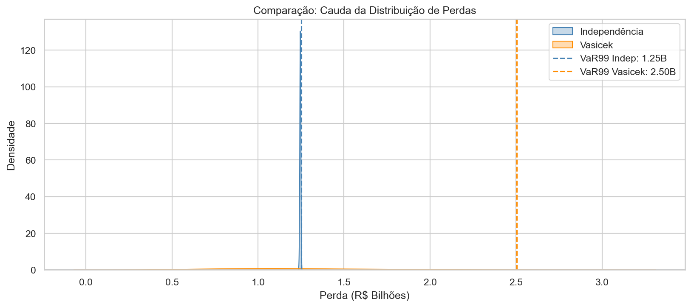

# Credit Risk Monte Carlo 

Em instituições financeiras, compreender o comportamento de perdas de uma carteira de crédito é essencial para a gestão de risco e definição de capital econômico.

Este projeto simula o risco de inadimplência de uma carteira de empréstimos utilizando **Monte Carlo Simulation**, permitindo estimar perdas potenciais e métricas clássicas utilizadas em gestão de risco financeiro.

A análise considera os três componentes fundamentais do risco de crédito:

- **Probability of Default (PD)** — probabilidade de inadimplência  
- **Loss Given Default (LGD)** — percentual de perda em caso de default  
- **Exposure at Default (EAD)** — exposição financeira no momento do default  

A perda associada a cada contrato é modelada pela relação:

Loss = Default × LGD × EAD

---

# Pergunta do Projeto

**Qual a perda esperada e o Value at Risk (VaR) de uma carteira de crédito considerando a incerteza nas taxas de default e na severidade da perda?**

Responder essa pergunta é essencial para compreender o comportamento de risco de uma carteira de crédito e avaliar possíveis cenários adversos.

---

# Dataset

**Fonte:** Kaggle  

**Nome:** Lending Club Loan Dataset  

**Link:** https://www.kaggle.com/datasets/wordsforthewise/lending-club

**Contexto**

O dataset contém informações históricas de empréstimos concedidos por uma plataforma de crédito peer-to-peer, incluindo características financeiras dos contratos, informações de clientes e status dos empréstimos.

O dataset contém milhares de contratos de empréstimo e diversas variáveis financeiras e comportamentais.

---

# Objetivo do Projeto

O objetivo deste projeto é reproduzir, de forma simplificada, uma abordagem utilizada em **modelagem de risco de crédito de portfólio**, utilizando simulação estatística para estimar perdas potenciais.

Especificamente, o projeto busca:

- compreender a estrutura dos dados de crédito
- realizar **análise exploratória estatística**
- aplicar **feature engineering em variáveis financeiras**
- estimar componentes de risco da carteira
- simular cenários de inadimplência utilizando **Monte Carlo**
- calcular métricas clássicas de risco financeiro

---

# Estrutura Analítica do Projeto

O projeto foi organizado em três etapas principais.

## 1 — Análise Exploratória de Dados

Primeiramente foi realizada uma exploração inicial dos dados para compreender sua estrutura e comportamento.

Foram analisados:

- tipos de variáveis
- distribuição das variáveis numéricas
- presença de valores ausentes
- padrões de comportamento financeiro
- correlação entre variáveis relevantes

Essa etapa é fundamental para entender o comportamento da carteira antes de qualquer modelagem.

---

## 2 — Feature Engineering

Na segunda etapa foram realizadas transformações para tornar os dados mais adequados para análise quantitativa.

Entre as principais transformações aplicadas:

- conversão de variáveis categóricas relevantes
- transformação de campos textuais em valores numéricos (ex: prazo do empréstimo)
- padronização de variáveis financeiras
- criação de variáveis derivadas úteis para análise de risco

Essa etapa permite transformar dados brutos em **variáveis analiticamente úteis para modelagem e simulação**.

---

## 3 — Simulação de Risco de Crédito

A etapa final consiste na simulação de perdas da carteira utilizando **Monte Carlo Simulation**.

O processo seguido foi:

1. Para cada contrato da carteira, utilizar sua **probabilidade de default (PD)**.
2. Simular eventos de inadimplência utilizando variáveis aleatórias.
3. Calcular a perda de cada contrato considerando **LGD e EAD**.
4. Agregar as perdas individuais para obter a perda total da carteira.
5. Repetir o processo milhares de vezes para gerar uma **distribuição de perdas**.

Essa abordagem permite estimar o comportamento probabilístico das perdas do portfólio.

---

# Métricas de Risco Calculadas

A simulação gerou as seguintes métricas de risco para a carteira analisada.

| Métrica | Valor |
|------|------|
| Exposição total da carteira | 8.897.981.225 |
| Expected Loss | 1.100.174.172 |
| Credit VaR 95% | 1.104.781.458 |
| Credit VaR 99% | 1.106.689.299 |
| Expected Shortfall 99% | 1.107.628.501 |

---

# Resposta à Pergunta do Projeto

A simulação Monte Carlo permitiu estimar o comportamento das perdas da carteira considerando a incerteza associada às probabilidades de default e à severidade da perda.

Os resultados indicam que:

- **Perda Esperada (Expected Loss):** 1.100.174.172  
- **Value at Risk (VaR) 95%:** 1.104.781.458  
- **Value at Risk (VaR) 99%:** 1.106.689.299  
- **Expected Shortfall 99%:** 1.107.628.501  

### Interpretação

A perda média esperada da carteira é de aproximadamente **1,1 bilhão**, considerando o comportamento médio dos contratos simulados.

Entretanto, em cenários adversos:

- Existe **5% de probabilidade** de a perda ultrapassar aproximadamente **1,10 bilhão**.
- Existe **1% de probabilidade** de a perda ultrapassar aproximadamente **1,106 bilhão**.

O **Expected Shortfall** indica que, nos piores 1% dos cenários simulados, a perda média da carteira pode atingir aproximadamente **1,107 bilhão**.

Essas métricas permitem compreender não apenas a perda média da carteira, mas também **o risco associado a cenários extremos**, informação fundamental para gestão de risco e definição de capital econômico em instituições financeiras.

---

# Distribuição de Perdas

A distribuição abaixo representa os resultados obtidos na simulação Monte Carlo.

A maior parte dos cenários concentra-se próxima à perda esperada da carteira, enquanto cenários extremos apresentam perdas superiores, capturadas pelas métricas de VaR e Expected Shortfall.

---

# Tecnologias Utilizadas

O projeto foi desenvolvido utilizando ferramentas amplamente utilizadas em ciência de dados e análise quantitativa.

- Python
- Pandas
- NumPy
- Matplotlib
- Seaborn
- Jupyter Notebook

---

# Conclusão

Este projeto demonstra como técnicas de **simulação estatística** podem ser utilizadas para analisar o risco de uma carteira de crédito.

Ao combinar análise exploratória, engenharia de variáveis e simulação Monte Carlo, é possível estimar não apenas a perda média esperada, mas também cenários extremos de risco.

Além da implementação técnica, o projeto demonstra **capacidade analítica e compreensão dos fundamentos quantitativos do risco de crédito**, competências essenciais em projetos reais de dados no setor financeiro.

